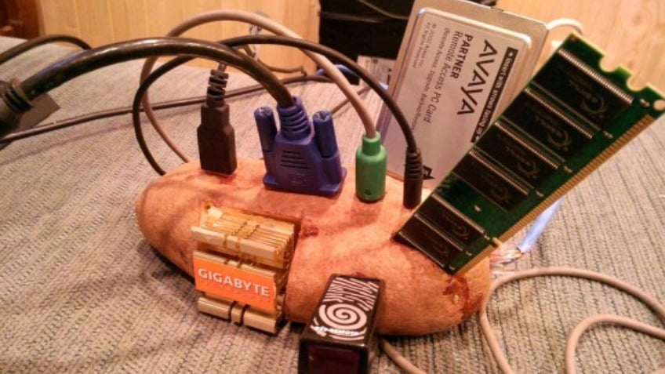
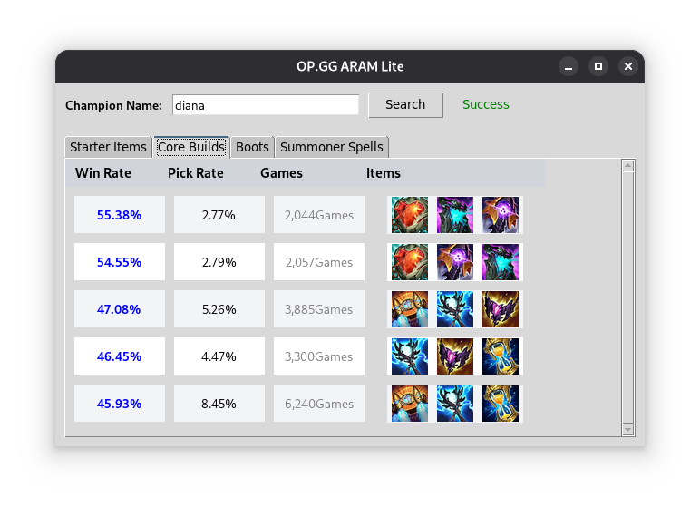

# OPGG ARAM Lite

This is a small tool vibe-coded to provide me with ARAM builds when playing league. It's meant to be very lightweight because my PC looks something like this:

### Preview

### TODO
- [ ] Fix error handling
